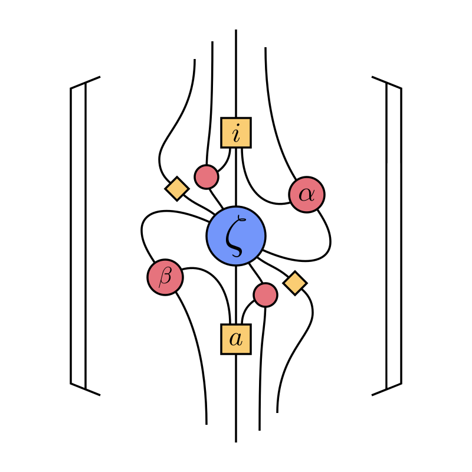

# zx-calc

    

*WARNING: This project is in a very early state! Main tools are usable (see
the list of features below), but may be buggy and/or error-prone.*

Contains tools for working in the ZX- and ZH-calculi, diagrammatic languages for
reasoning about linear maps between two-level quantum states.

## Features
- Multiple diagram representations
    - [x] Simple tensor-based generator representations, sparse and dense
    - [x] Proper graph-based representations with rewrite rules
    - [x] Render to DOT/graphviz
    - [x] Conversion between representations
- Diagram tools
    - [x] Scalar computation
    - [ ] Diagram composition/tensoring (partial: untested)
    - [ ] Diagram simplification (graph-based only) (partial: untested)
    - [x] ZX rewrite rules
    - [x] ZH rewrite rules
    - [ ] Single, exhaustive "simplify" (partial: waiting on testing with
      different strategies)
    - [x] Scalar computation and removal
    - [ ] Equality testing via simplification
    - [ ] High-level generic interface for circuit-building
- Circuits
    - [ ] Basic ranked circuit representation
    - [ ] Read/write OpenQASM
    - [ ] Render to Graphviz
    - [ ] Conversion to diagram representations
    - [ ] Circuit extraction from diagrams

## Helpful resources
* B. Coecke, "Basic ZX-calculus for students and professionals."
  [arXiv:2303.03163](https://arxiv.org/abs/2303.03163)
* J. van de Wetering, "ZX-calculus for the working quantum computer scientist."
  [arXiv:2012.13966](https://arxiv.org/abs/2012.13966)
* R. Moyard, "Introduction to the ZX-calculus."
  [Pennylane](https://pennylane.ai/qml/demos/tutorial_zx_calculus/)
* H. Bombin *et al.*, "Unifying flavors of fault tolerance with the ZX
  calculus." [arXiv:2303.08829](https://arxiv.org/abs/2303.08829)

## See also
* [PyZX](https://github.com/Quantomatic/pyzx): a Python implementation of the
  ZX-calculus and its rewrite rules
* [QuiZX](https://github.com/Quantomatic/quizx/tree/master): a Rust
  implementation of the above.

